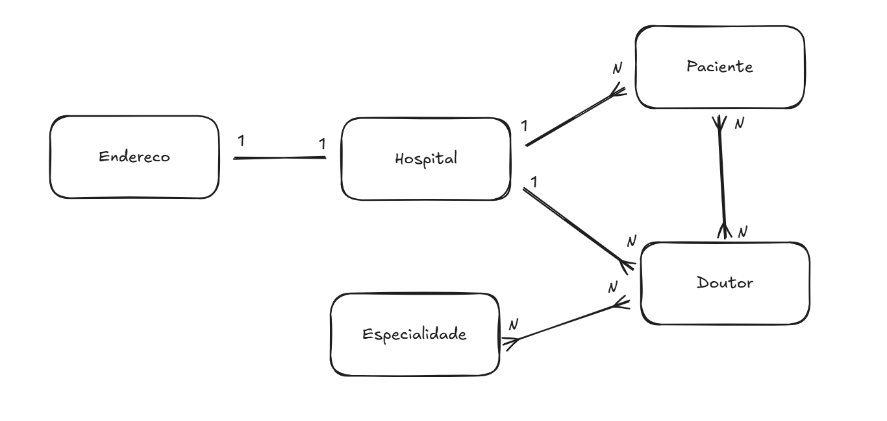

# 🏥 Hospital API (CP2 - FIAP)

Este projeto consiste no desenvolvimento de uma **API RESTful com Spring Boot**, focada na modelagem e gerenciamento de dados de um hospital. A aplicação foi criada como parte da avaliação prática (CP2) da disciplina, com o objetivo de aplicar todos os conceitos vistos em aula.

---

## 🎯 Objetivo

Construir uma API completa com:

- CRUD para múltiplas entidades
- Validações robustas com Bean Validation
- Relacionamentos bem definidos com JPA
- Documentação com Swagger
- HATEOAS para enriquecimento das respostas
- Uso de Gradle e banco de dados em memória H2

---

## 👥 Equipe

- **Leonardo Teixeira** — responsável pela definição da ideia, modelagem do sistema (entidades e relacionamentos), criação dos repositórios e organização inicial do projeto.
- **Gabriel Marques** — responsável pela camada de serviços (Service), mapeamento com DTOs e implementação dos Mappers.
- **Leonardo Ribas** — responsável pelos controllers, documentação Swagger e integração com HATEOAS.

---

## 🧱 Entidades Modeladas

- **Hospital** → possui nome, CNPJ, endereço e está vinculado a doutores e pacientes.
- **Paciente** → nome, CPF, telefone, doenças, data de nascimento, hospital e doutores responsáveis.
- **Doutor** → nome, CRM, e-mail e especialidades. Atende múltiplos pacientes.
- **Especialidade** → nome e descrição. Uma especialidade pode ser compartilhada por vários doutores.
- **Endereco** → entidade separada com logradouro, número, complemento, cidade, bairro, estado e CEP, usada com `@OneToOne` em `Hospital`.

---

## 🔄 Relacionamentos

- `Paciente` ↔ `Doutor` → **Many-to-Many**
- `Doutor` ↔ `Especialidade` → **Many-to-Many**
- `Paciente` → `Hospital` → **Many-to-One**
- `Doutor` → `Hospital` → **Many-to-One**
- `Hospital` → `Endereco` → **One-to-One**

---

## 🔒 Validações Utilizadas

- `@NotBlank` → campos obrigatórios
- `@Pattern` → para validar CPF, telefone e CNPJ com regex
- `@Email` → validação de e-mail
- `@Past` → para garantir que datas de nascimento estejam no passado
- `@Column(unique = true)` → restrições de unicidade no banco

---

## 🚀 Tecnologias e Ferramentas

- Java 21
- Spring Boot 3.4.4
- Spring Data JPA
- Spring Web
- Spring HATEOAS
- Jakarta Bean Validation
- H2 Database
- Gradle
- Swagger/OpenAPI

---

## 📊 Diagrama de Entidades

